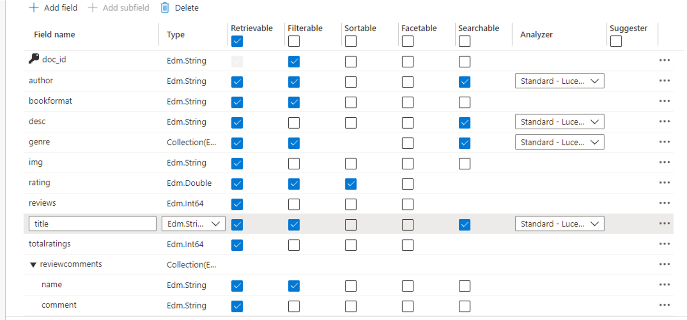
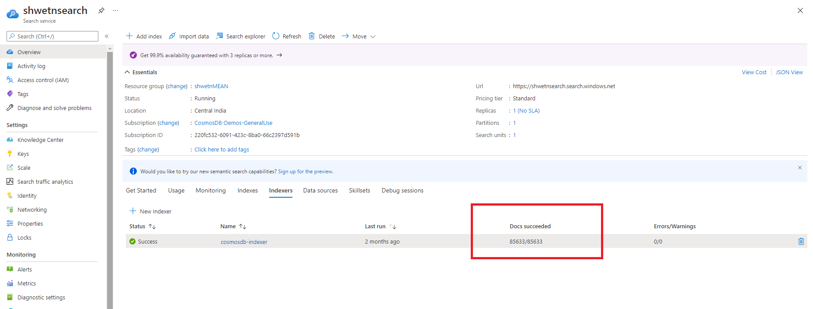

# Setup Azure Search integration

- [Create an Azure Search service resource](https://docs.microsoft.com/en-us/azure/search/search-create-service-portal)

- [Import & index the Cosmos DB API for MongoDB data](https://docs.microsoft.com/en-us/azure/search/search-howto-index-cosmosdb#use-the-portal)
  - While setting up the data source, make sure the Cosmos DB account field looks like below:
  AccountEndpoint=https://<Cosmos DB account name>.mongo.cosmos.azure.com;AccountKey=<Cosmos DB auth key>;**ApiKind=MongoDb**
  - These are index attributes I chose for the current app
    
  - The indexer will take a few minutes to finish crawling all the documents. You will be able to validate the indexer progress from the overview blade of the search service
  

- Edit the SEARCH_API_KEY, SEARCH_API_ENDPOINT and SEARCH_INDEX_NAME variables in the Configuration > Application settings of the App service resource created by the deployment and then 'Save' the settings. That will apply the changes and restart the app. 
Now you should be able to use the full text search functionality in the Cosmos Bookstore app!
